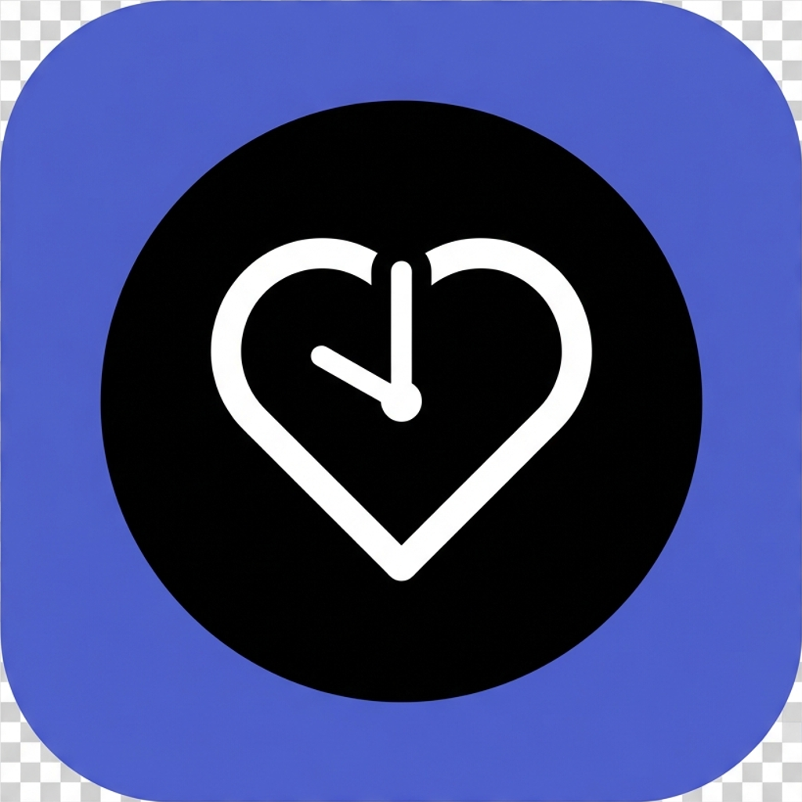

# Desk Health



Desk Health is a modern, wellness-focused timer application designed for desk workers. It helps you maintain a healthy work-life balance by reminding you to take regular breaks, stretch, and stay hydrated, all wrapped in a sleek, non-intrusive interface.

## 📥 Download

**Get the latest version for Windows:**
[**Download Desk Health Setup (.exe)**](https://github.com/dgalue/Desk_Health_App/releases/latest)

Simply download, run the installer, and you're good to go! No additional software required.

## ✨ Features

- **Smart Timer**: Configurable Focus (25m), Short Break (5m), and Long Break (15m) intervals.
- **Exercise Library**: Built-in database of desk-friendly exercises with custom add/edit capabilities.
- **Customization**:
  - **Meal Mode**: Dedicated timer for lunch breaks.
  - **Custom Sounds**: Choose from multiple notification chimes.
  - **Dark Mode**: Optimized for eye comfort.
- **System Integration**:
  - **Start Minimized**: Option to start quietly in the system tray.
  - **Native Notifications**: System-level alerts when timers complete.
  - **Single Instance**: Prevents multiple windows from cluttering your workspace.
  - **Tray Control**: Quick access via system tray icon.

## 🛠 Tech Stack

- **Framework**: [Electron](https://www.electronjs.org/) (v40)
- **Frontend**: [React](https://react.dev/) + [Vite](https://vitejs.dev/)
- **Language**: JavaScript (ESM for React, CJS for Electron)
- **Styling**: Modern CSS Variables & Design Tokens (Linear-style aesthetic)
- **Packaging**: [electron-builder](https://www.electron.build/)

## 💻 Development (Build from Source)

If you want to contribute or build the app yourself, follow these steps:

### Prerequisites

- [Node.js](https://nodejs.org/) (v16.x or higher)
- [npm](https://www.npmjs.com/) (v7.x or higher)

### Installation

1.  **Clone the repository**
    ```bash
    git clone https://github.com/dgalue/Desk_Health_App.git
    cd desk-health
    ```

2.  **Install dependencies**
    ```bash
    npm install
    ```

3.  **Run in Development Mode**
    ```bash
    npm run electron:dev
    ```

### Building the Application

To build the executable for Windows (Installer + Portable):

```bash
npm run electron:build
```

The output files will be in the `release/` directory:
- `Desk Health Setup X.X.X.exe` (Installer)
- `win-unpacked/Desk Health.exe` (Portable)

> **Note**: The build configuration currently disables Desktop Shortcut creation (Start Menu only). To change this, edit `package.json` -> `nsis` -> `createDesktopShortcut`.

## 🔧 Configuration & Customization

### Application Icons
The app uses specific icon configurations for different contexts:
- **Window Icon**: `public/icon.ico` (Window titlebar)
- **Tray Icon**: `public/tray-icon.png` (System tray)
- **Sidebar**: `public/icon.png` (In-app sidebar)
- **Installer**: Configured in `package.json` (NSIS section)

### Code Signing
By default, this project is configured to skip code signing (`forceCodeSigning: false`) for local development.
- **Impact**: The executable file (`.exe`) icon in Windows Explorer will use the default Electron icon.
- **Fix**: The Installer correctly sets the Start Menu icon. To enable full icon embedding on the `.exe`, a valid Code Signing Certificate must be configured in `electron-builder`.

## 🧪 Testing & Verification

A comprehensive test database containing verification steps, test cases, and known limitations is available in [TEST_DATABASE.md](./TEST_DATABASE.md). Use this as a reference or QA template.

## 📝 License

Distributed under the MIT License.
